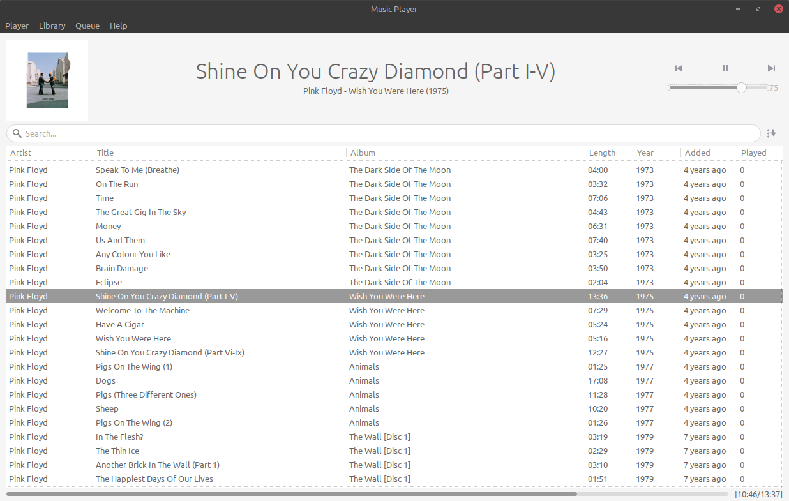

# MusicPlayer

A simple music player written in python 

##   Features
-   Support all the most popular music file formats
-   Gapless playback
-   Resumes playback on startup
-   Automatically fetch:
    - Album covers
    - Lyrics 
    - ASCII and Guitar Pro tabs

## Configuration

Create the file `musicplayer/config/secret.py` with this line:
    
    LASTFM_SECRET_API_KEY = '__'

### On Linux

Download the following package:

    gtk3
    python-gobject
    python-pip
    gcc
    taglib
    gst-python
    gst-plugins-base
    gst-plugins-good
    gst-plugins-bad
    gst-plugins-ugly
    libkeybinder3

Download the pip requirements and run:

    make init
    make run

### On Windows

Download the following package with [MSYS2](http://www.msys2.org/):

    mingw-w64-i686-gtk3
    mingw-w64-i686-python3-gobject
    mingw-w64-i686-python3-pip
    mingw-w64-i686-gcc
    mingw-w64-i686-taglib
    mingw-w64-i686-python3-lxml
    mingw-w64-i686-swig 
    mingw-w64-i686-gst-python
    mingw-w64-i686-gst-plugins-base
    mingw-w64-i686-gst-plugins-good
    mingw-w64-i686-gst-plugins-bad
    mingw-w64-i686-gst-plugins-ugly

Download the pip requirements and run:

    mingw32-make init
    mingw32-make run

