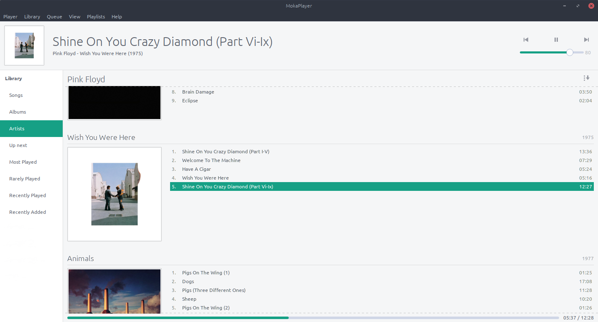

# MokaPlayer

A music player written in python 
    

   
## Prerequisites
-   TagLib
-   Python 3.6.0
-   PyGObject
-   GStreamer

## Installing
```sh
pip install mokaplayer
```

##   Features
-   Support all the most popular music file formats
-   Gapless playback
-   Resumes playback on startup
-   Edit tags for multiple files at the same time
-   Playlists
-   Go to [Artist/Album] with CTRL-P
-   Filter with CTRL-F
-   Automatically fetch:
    - Album covers
    - Artist covers
    - Lyrics 
    - ASCII and Guitar Pro tabs

## Configuration

If you clone the repository you need to create the file `mokaplayer/config/secret.py` with this line: 
```python
    LASTFM_SECRET_API_KEY = 'YOUR_API_KEY'
```

### On Windows

Download the following packages with [MSYS2](http://www.msys2.org/):
```sh
mingw-w64-i686-gtk3
mingw-w64-i686-python3-gobject
mingw-w64-i686-python3-pip
mingw-w64-i686-gcc
mingw-w64-i686-taglib
mingw-w64-i686-python3-lxml
mingw-w64-i686-swig 
mingw-w64-i686-gst-python
mingw-w64-i686-gst-plugins-base
mingw-w64-i686-gst-plugins-good
mingw-w64-i686-gst-plugins-bad
mingw-w64-i686-gst-plugins-ugly
```
